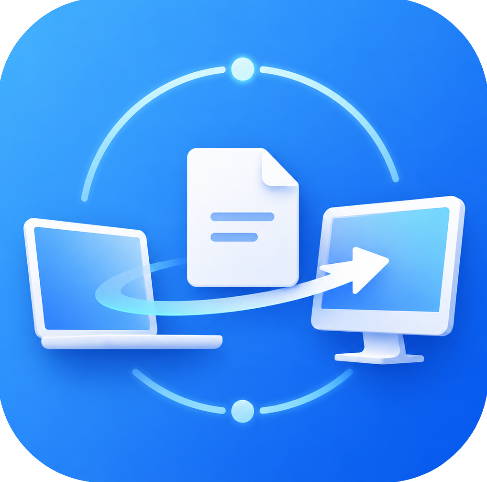

# Nearfy

<div align="center">
  
  <br />
  <p><strong>局域网文件传输工具</strong></p>
  <p>基于 Wails v3 构建，支持 macOS 和 Windows</p>
  <p>
    
    
  </p>
</div>

## 功能

- **自动发现设备** — UDP 广播自动发现同一局域网内的在线设备
- **文件传输** — 点对点 TCP 直传，支持大文件分块传输
- **拖拽发送** — 直接拖拽文件到窗口即可发送
- **接收确认** — 接收方可选择保存路径后再接收
- **进度显示** — 实时显示传输进度和速率
- **MD5 校验** — 传输完成后自动校验文件完整性
- **取消传输** — 发送方和接收方均可随时取消，自动清理临时文件
- **自动更新** — 启动时检测新版本，一键下载安装并重启

## 下载

从 [GitHub Releases](https://github.com/wangjin/Nearfy/releases/latest) 下载最新版本。

| 平台 | 文件 |
|------|------|
| macOS | `Nearfy-macos.dmg` |
| Windows | `Nearfy-windows-amd64.exe` |

### macOS 使用说明

双击打开 .dmg 文件，将 Nearfy 拖入 Applications 文件夹即可。如果提示"无法打开"或"已损坏"，请在终端执行：

```bash
xattr -cr /path/to/Nearfy.app
```

## 技术栈

- **后端:** Go + Wails v3
- **前端:** React + TypeScript + Vite
- **协议:** UDP 广播发现 + TCP 文件传输，自定义二进制协议（长度前缀 + JSON 信封）
- **更新:** GitHub Releases API + 平台感知替换（macOS .dmg / Windows exe）

## 开发

### 前置依赖

- Go 1.25+
- Node.js 22+
- [Wails v3 CLI](https://wails.io/) (`go install github.com/wailsapp/wails/v3/cmd/wails3@latest`)
- [Task](https://taskfile.dev/) (`go install github.com/go-task/task/v3/cmd/task@latest`)

### 运行开发模式

```bash
wails3 dev
# 或
task dev
```

### 构建

```bash
# 当前平台
task build

# 指定平台
task build:darwin:arm64
task build:windows:amd64

# 全平台
task build:all
```

### 打包

```bash
# macOS .app bundle
task package:darwin

# macOS .dmg
task package:darwin:dmg
```

### 测试

```bash
task test
```

## 项目结构

```
├── main.go                         # 程序入口，版本注入
├── app.go                          # 应用初始化、服务编排
├── app_transfer.go                 # 文件传输前端调用入口
├── app_discovery.go                # 设备发现前端调用入口
├── app_runtime.go                  # Wails 运行时封装
├── internal/
│   ├── discovery/                  # UDP 广播设备发现
│   ├── transfer/                   # TCP 文件传输引擎
│   ├── protocol/                   # 传输协议编解码
│   ├── queue/                      # 传输任务队列管理
│   ├── model/                      # 数据模型
│   └── updater/                    # 自动更新（版本检测、下载、安装）
├── frontend/
│   ├── bindings/                   # Wails 自动生成的 TS 绑定
│   └── src/
│       ├── hooks/                  # 状态管理 hooks（useDevices, useTransfers, useUpdate）
│       └── components/             # UI 组件
├── Taskfile.yml                    # Taskfile 多平台构建
└── .github/workflows/              # CI（PR 测试）和 Release（tag 推送时构建发布）
```

## 发布新版本

推送 tag 即可触发自动构建和发布：

```bash
git tag v1.1.0
git push origin v1.1.0
```

CI 会自动构建 macOS .dmg 和 Windows exe，生成分类 Release Notes 并创建 GitHub Release。

## License

MIT
